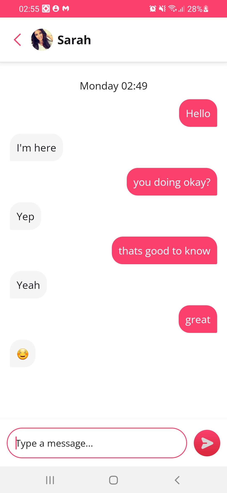

# android-test-assignment
A Messaging app illustrating Android development best practices with jetpack compose.

# Features
- Message history
- Auto reply using ML Kit
- Item sectioning

# Technologies
- MVVM with clean code architecture.
- Flows
- Coroutines
- Koin dependency injection tool
- Jetpack compose
- Junit
- MockK
- ML Kit

# Screenshot

<b>Modular Architecture:</b>
The app adopts a modular architecture, promoting separation of components for better maintenance and scalability: